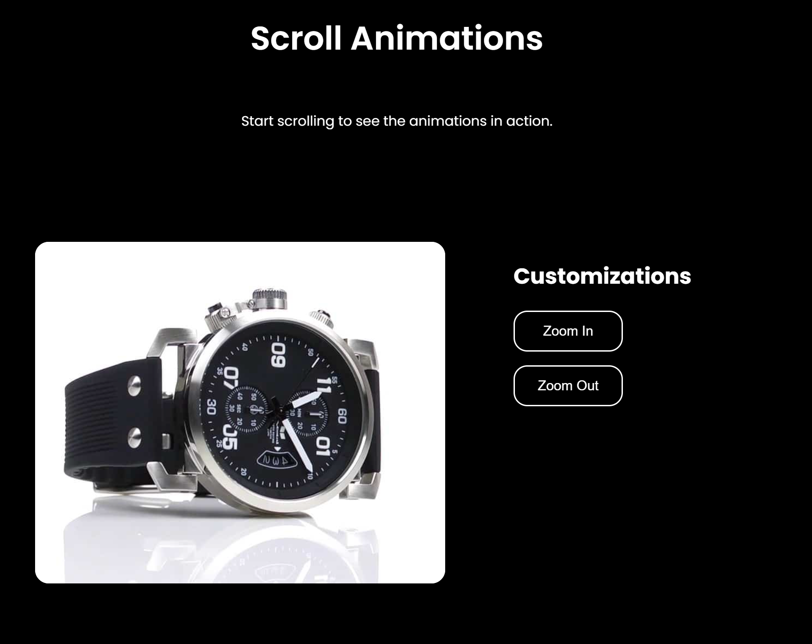

# Scroll Animations

An engaging and interactive animation experience created using pure HTML, CSS, and JavaScript. This project showcases smooth, seamless image transitions that respond dynamically to user scrolling, similar to animations found on Apple's product pages.

## Table of Contents

1. [About the Project](#about-the-project)

2. [Live Demo](#live-demo)

3. [Technologies Used](#technologies-used)

4. [Features](#features)

5. [Installation and Usage](#installation-and-usage)

6. [Project Structure](#project-structure)

7. [Customization](#customization)

8. [Performance Optimization](#performance-optimization)

9. [Potential Enhancements](#potential-enhancements)

10. [Contact](#contact)

11. [License](#license)

## About the Project

This project demonstrates my ability to integrate HTML, CSS, and JavaScript effectively to create visually appealing and responsive scroll-based animations. It highlights interactive and fluid UI design principles suitable for marketing, storytelling, or product showcase web pages.

## Live Demo

Check out the [live demo here](https://jasr1.github.io/scroll-animations/) to experience the animations firsthand.

## Technologies Used

- **HTML5**

- **CSS3**

- **JavaScript (Vanilla JS)**


## Features

- **Smooth Image Rotation**: Images seamlessly transition based on scroll depth, creating a smooth, fluid rotation effect.

- **Zoom Controls**: Interactive buttons allowing the user to zoom in and out dynamically, with multiple zoom levels.

- **Preloaded Images**: All images are preloaded to ensure smooth scrolling and animation without lag.

- **Responsive Design**: Adjusts seamlessly across devices ensuring an optimal viewing experience.

- **Reset Functionality**: Easily revert all customizations and return to the default view.

## Installation and Usage

To view or modify this project locally:

1. Clone this repository:
```bash
git clone https://github.com/jasr1/scroll-animations.git
```

2. Navigate to the project directory:
```
cd scroll-animations
```

3. Open the index.html file in any modern browser to experience the animation directly.


## Project Structure


```
scroll-animations/
├── img/                  # Contains the animation images
├── scripts/
│   └── script.js         # JavaScript functionality
├── styles/
│   └── main.css          # Styles for layout and responsiveness
└── index.html            # Main HTML file
```


## Customization

- **Image Sequence**: Change or add images in the ```img``` directory. Update ```frameCount``` in ```scripts/script.js```.

- **Zoom Levels**: Adjust zoom amounts in the JavaScript file (```zoomInAmount```, ```zoomOutAmount```) for different zoom experiences.

- **Styles**: Customize the design via CSS in ```styles/main.css```.

## Performance Optimization

- **Image Preloading**: Images are preloaded to avoid scroll stuttering.

- **Canvas**: Efficient rendering of images to enhance animation smoothness.

- **Minimal DOM Manipulation**: JavaScript efficiently updates only necessary elements.

## Potential Enhancements

Future improvements might include:

- Enhanced mobile device compatibility and touch interactions.

- Adding more animation effects (fade, slide, etc.).

- Implementing additional UI controls and user customization options.

- Optimizing further for performance (lazy loading, compression techniques).

## Contact

Feel free to connect with me:

- **GitHub**: [jasr1](https://github.com/jasr1)

- **LinkedIn**: [LinkedIn](https://www.linkedin.com/in/jasrandhawa-softwaredeveloper/)


Thank you for exploring this project!

## License

This project is licensed under the MIT License. See the [LICENSE](LICENSE) file for details.

